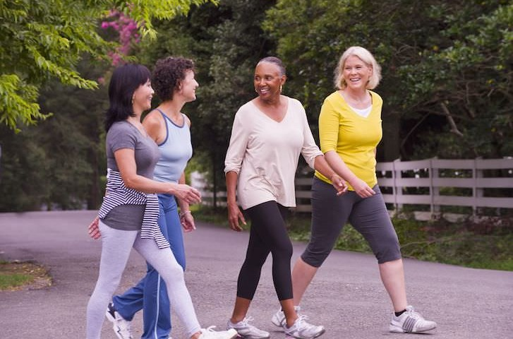

I have a client with mild vascular dementia, who is upset about losing her memory, ability to manage her responsibilities, and her independence.  I encourage her to exercise daily, not only to reduce her risk of falls, but also to improve her brain health and memory.  But, she was never physically active, and as she’s aged, finds even less motivation to exercise because of the intensity of effort.  

In a [recent study](https://www.nytimes.com/2020/07/15/well/move/how-exercise-may-bolster-the-brain.html) described in the New York Times, exercise prompts the liver to produce a protein, which rejuvenates the brain and memory of humans.  Older men and women who habitually walked for exercise showed higher levels of this protein than those who did not.  Overall, [studies](https://www.ncbi.nlm.nih.gov/pmc/articles/PMC6770965/) show physical activity delays brain aging, and degenerative conditions such as Alzheimer’s and diabetes, improves cognitive processes and memory, has analgesic and antidepressant effects, and induces a sense of wellbeing.  

Exercise to maintain your mind and body.