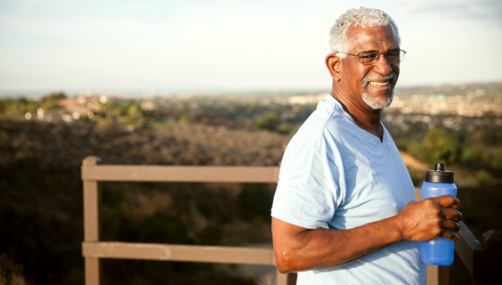

According to the CDC, the risk of severe illness from COVID-19 increases with age.  Risk of contracting COVID-19 increases as you interact with more people, closely, and for longer periods.  As a result, many older adults reduced outdoor activities, including exercise.  However, older adults need activity to stay healthy, strengthen immune systems, and reduce fall risk.  Mayo clinic recommends outdoor activity as long as people avoid large gatherings, and maintain six feet distance from others.  Wear a mask if possible, and wash your hands before and after each activity.  See below a few ways to stay active during this pandemic:

- Participate in a Zoom exercise class organized by your local senior center
- Play outdoor tennis
- Walk, run, hike, or bike in your favorite park
- Enroll in an outdoor fitness class that allows appropriate distancing

Be smart, engage safely, and stay active during this pandemic.