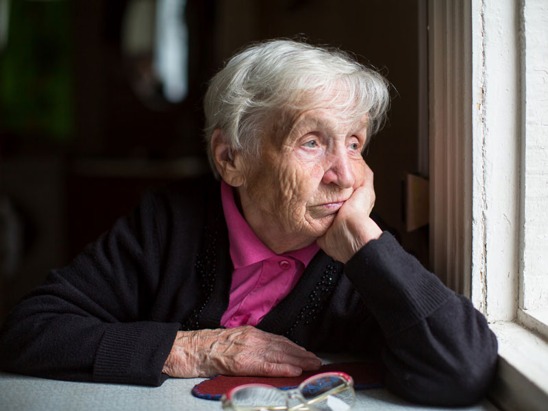

Some of my clients complain of being tired and having no energy.  They spend most of the day reclined in a chair or in bed, only getting up to eat or use the restroom.  They participate and talk during the physical therapy session, but rarely do their home exercises, go outside, or engage in other activities.  One client states every visit, “They call this golden age, this is not golden age, this is shitty age.”

Older adults are at increased risk of depression because of chronic diseases, and reduced function.  They are often misdiagnosed because symptoms appear as a normal reaction to illness or life changes.  CDC estimates major depression of about 1-5% in community ambulating older adults, 13.5% in those requiring home health care, and 11.5% in older hospital patients.  

According to NIH, “yes” to the following questions may indicate depression:

- Do you feel very tired, helpless, and hopeless?
- Have you lost interest in many of the activities and interests you previously enjoyed?
- Are you having trouble working, sleeping, eating, and functioning?
- Have you felt this way day after day?

Check with your doctor or healthcare provider if you experience these symptoms.  Take advantage of the following resources and support services:

- Your local senior center, offering free services for adults over 60 years old.  Some senior centers offer transportation, and social workers provide information on community resources.  Also, senior centers have cultural activities, various programs, volunteer opportunities, and group exercise classes promoting socialization and physical activity, critical components of depression treatment.
- Psychotherapy, which research shows is as effective as antidepressants without the side effects (antidepressants increase the risk of falling in older adults).    Medicare pays for this benefit, and some psychotherapists visit the home.
- Call NYC Well at 1-888-692-9355 for free and confidential support.