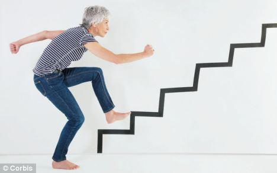

Clients sometimes mention to me they should go to an outpatient physical therapy facility as their condition improves.  After all, these facilities have equipment.  I worked in a physical therapy office located in an Equinox gym on Wall Street more than a decade ago.  I saw traders and other finance junkies, screaming through their bench presses, with immense pec and deltoid muscles, returning to their sedentary, screen focused, keyboard fingered jobs.  I always thought to myself, their workout, building impressive upper body strength, does not translate to their jobs' physical requirements.  Inevitably, many would eventually visit me with neck pain.

I tell my clients they don’t need fancy equipment to get better.  [Research](https://link.springer.com/article/10.1007/s11556-014-0144-1) supports the specificity of training principle.  You achieve the best gains in performance when the training closely mimics the performance.  For example, suppose an older adult wants to improve her sit to stand ability, then the most effective way is to practice sit to stand.  This type of functional training may be a better option than muscle strength training alone if the goal is to reduce disability in older adults.  This specificity of training principle also applies to younger adults.  In a recent [Journal of Orthopaedic and Sports Physical Therapy article](https://www.jospt.org/doi/full/10.2519/jospt.2017.7349), a task-specific training approach for patients with chronic knee pain aged 40 years and older showed considerable improvement in pain and function for most of the individuals.  These patients had pain with sit to stand transfers and stair negotiation, and practiced these aspects with feedback from a physical therapist.   

The solution to your movement problems may be closer to home than you expected. 
