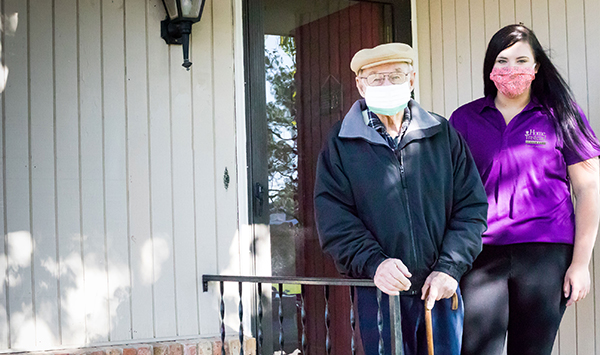

People may fear having physical therapy, as interacting with others increases the risk of COVID-19 transmission.  As with any treatment option, weigh the risks and benefits to determine the appropriate course of action.  [Home physical therapy](https://www.smartmovesphysicaltherapy.com/house-call/) is as effective as physical therapy in a clinic and overall benefits include:

- Fall prevention
- Improved balance, mobility, and movement
- Pain reduction
- Quicker recovery from injury
- Management of chronic conditions, such as Parkinson’s

The risk of COVID-19 transmission reduces greatly by wearing a mask, washing hands frequently, and maintaining a safe distance (six feet apart).  Evidence shows wearing a mask helps prevent people infected with COVID-19 from transmitting the virus.  For example, in late May, two hairstylists in Missouri had close contact with 140 clients while sick with COVID-19.  Everyone wore a mask and none of the clients tested positive.  Maintaining a safe distance may not always be possible during a physical therapy session.  As such, the combination of mask wearing, and hand washing becomes even more important to create a safe environment.   In this [article](https://www.ucsf.edu/news/2020/06/417906/still-confused-about-masks-heres-science-behind-how-face-masks-prevent), George Rutherford, MD, an epidemiologist recommends people always wear masks and socially distance, but thinks mask wearing is more important.

A home physical therapy session, accompanied by protective measures of mask wearing, hand washing, and safe distancing, is a safe and effective treatment option.