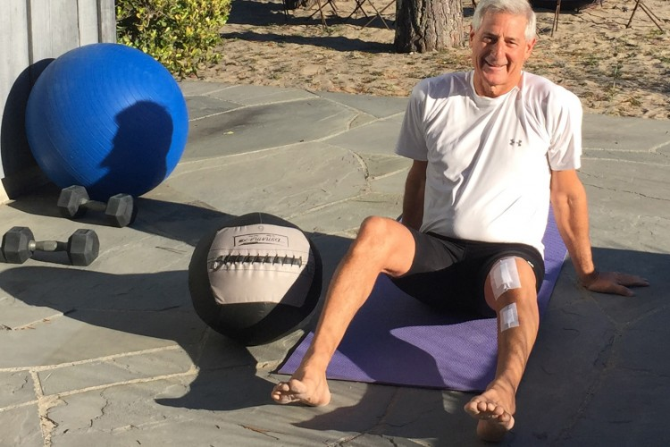

This guide summarizes best practices.  The best care involves a combination of best practices, and the healthcare provider’s and patient's inputs.

***

#### 3 days - 3 weeks post surgery

**Goals**

- Reduce swelling and pain
- Increase knee range of motion
- Increase strength
- Increase independence with transfers and gait (weight bearing as tolerated with assistive device)
- Monitor wound healing for signs and symptoms of infection

**Intervention**

- Ice 10-15 minutes, multiple times a day to reduce swelling and pain
- Exercises (with guidance of your therapist)
- Ankle pumps
- Heel slides
- Quad sets
- Short and long arc quads
- Straight leg raise (4- way, modified as appropriate)
- Hip flexor, hamstring and calf stretching
- Gait:  progress from walker or crutches to cane

***

#### 3-6 weeks post surgery

**Goals**

- Reduce swelling and pain
- Increase knee range of motion
- Increase strength
- Improve balance
- Normalize functional activities

**Intervention**

- Ice 10-15 minutes, as needed, to reduce swelling and pain
- Additional exercises (with guidance of your therapist)
- Standing hip abduction
- Standing knee flexion
- Standing heel and toe raises
- Balance exercises
- Stationary bike
- Functional activities training 
    - Sit to stand
    - Stairs
    - Gait without assistive device, as tolerated

***

#### 6-12 weeks post surgery

**Goals**

- Begin endurance activities

**Intervention**

- Progress strength and balance exercises
- Begin endurance activity (walking, swimming, progress stationary biking)

***

#### 3+ months post surgery

- Continue walking, swimming, and stationary biking for aerobic conditioning
- Begin other recreational activities (golf, outdoor cycling, impact sports such as tennis or jogging) with clearance from surgeon